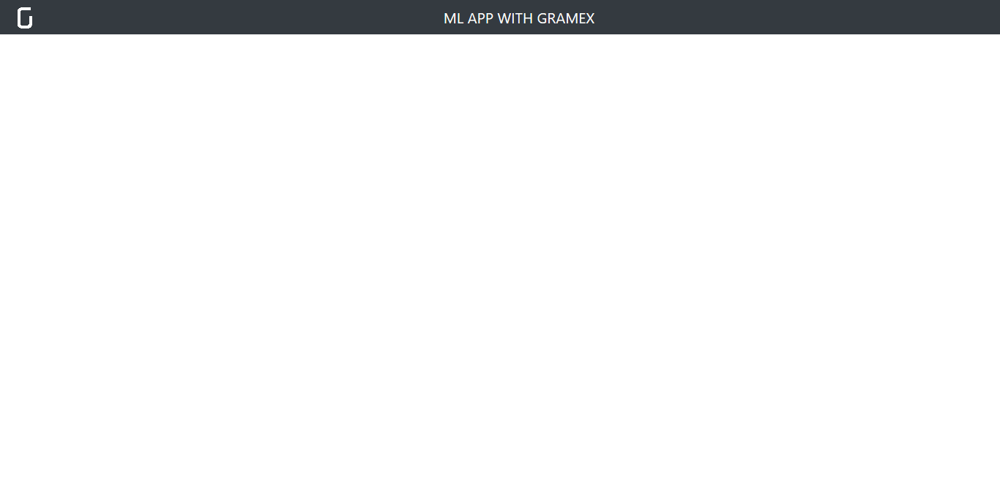
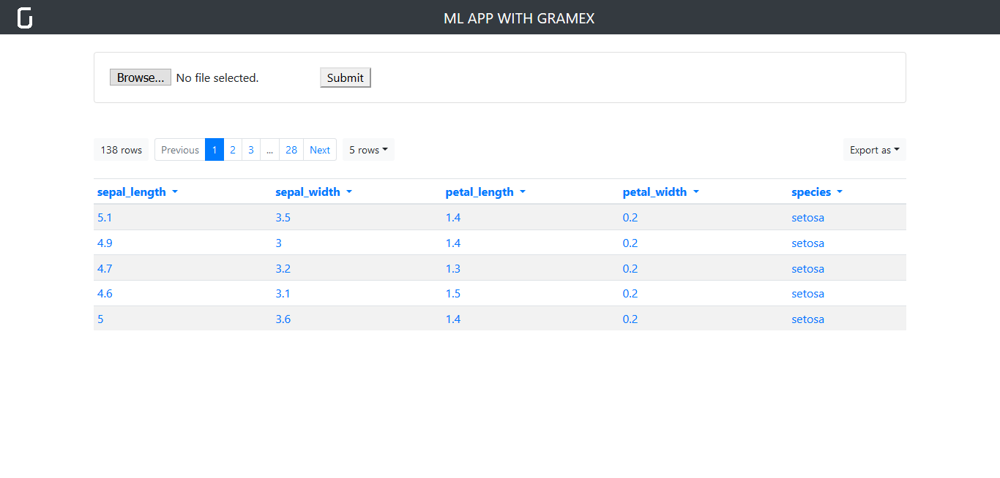
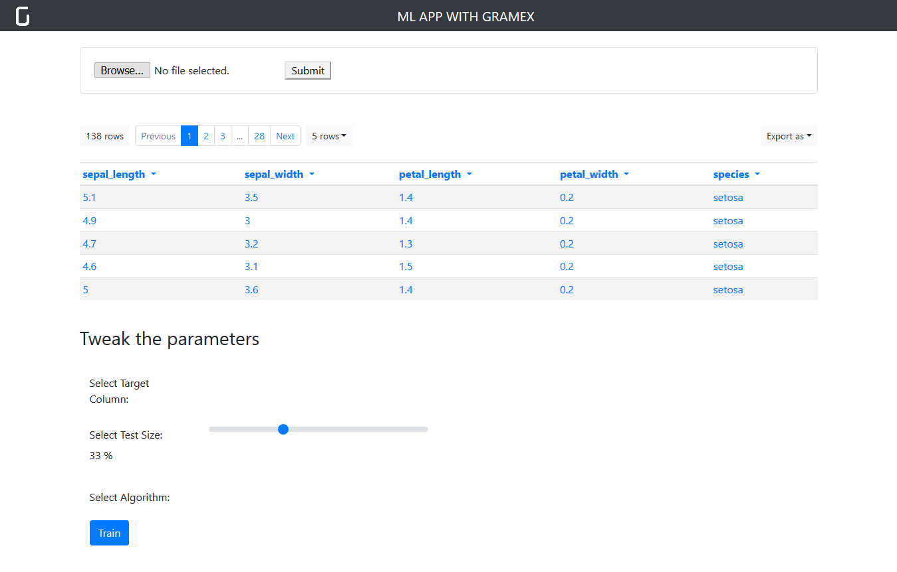
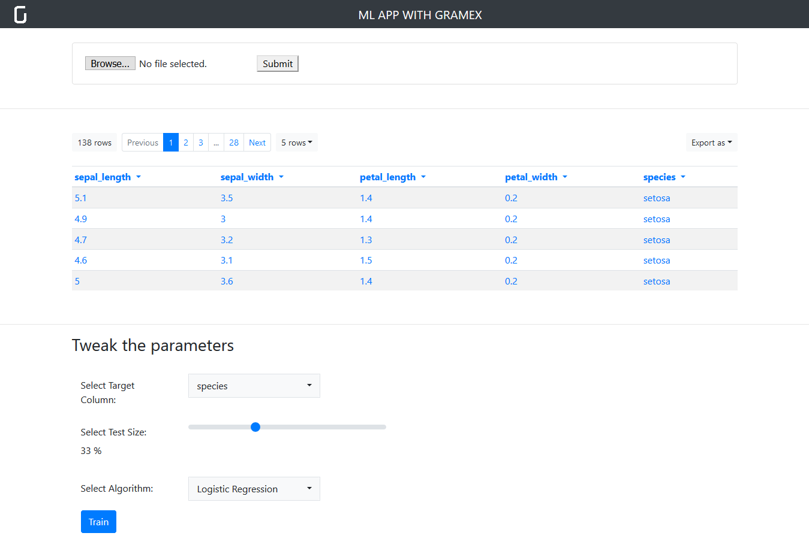

# Snippets

Snippets directory provides minimal utilites to build a simple web page for the workshop.

# Application Components

## Structure

- snippets
  - base.html
  - upload.html
  - table.html
  - training.html
  - README.md

## Build your application

every `HTML` file below can be rendered by requesting for

http://localhost:9988/snippets/base or

http://localhost:9988/snippets/upload_file or 

http://localhost:9988/snippets/table or

http://localhost:9988/snippets/training or

http://localhost:9988/snippets/final

Each view below builds on top of the previous step.

### Step 0 - curated.html

We'll create this `curated.html` using the steps defined below.

### Step 1 - base.html

Begin with base.html, you'll a navbar (header for the page).

The corresponding `YAML` routing (found in [gramex.yaml](../gramex.yaml)) is as below:

```yaml
  workshop/snippets/base:
    pattern: /$YAMLURL/snippets/base
    handler: FileHandler
    kwargs:
      path: $YAMLPATH/snippets/base.html
      template: true
```

Your page should now look like below



### Step 2 - upload.html

In `base.html`, add the content from `upload.html`.

The corresponding `YAML` routing (found in [gramex.yaml](../gramex.yaml)) is as below:

```yaml
  workshop/snippets/upload:
    pattern: /$YAMLURL/snippets/upload_file
    handler: FileHandler
    kwargs:
      path: $YAMLPATH/snippets/upload.html
      template: true
```

Your page should now look like below


### Step 3 - table.html

We rely on a table renderer from `g1` library named `formhandler table`.

For it to work, we need to integrate few lines of `JavaScript`.

```html
<script src="../ui/jquery/dist/jquery.min.js"></script>
<script src="../ui/bootstrap/dist/js/bootstrap.bundle.min.js"></script>
<script src="../ui/lodash/lodash.min.js"></script>
<script src="../ui/g1/dist/g1.min.js"></script>
<script>
  // '.formhandler' is the div element in `table.html`
  $('.formhandler').formhandler({
    pageSize: 5
  })
</script>
```

The corresponding `YAML` routing (found in [gramex.yaml](../gramex.yaml)) is as below:

```yaml
  workshop/snippets/table:
    pattern: /$YAMLURL/snippets/table
    handler: FileHandler
    kwargs:
      path: $YAMLPATH/snippets/table.html
      template: true
```

also note that rendering the table relies on `data` endpoint in [gramex.yaml](../gramex.yaml)):

```yaml
  formhandler:
    pattern: /$YAMLURL/snippets/data
    handler: FormHandler
    kwargs:
      url: $YAMLPATH/upload_data/data.csv
```

Your page should now look like below



To know more about g1's formhandler table, visit https://learn.gramener.com/guide/g1/.

### Step 4 - training.html

Your page should now look like below



## Interactions

Let's now discuss how the application will function interactively (on user input). User can:

- upload a file
  - upon which table is updated
  - `Tweak the parameters` section is updated
- Train the model

### File upload

Gramex handles any file uploads via `UploadHandler` with several out-of-the-box features (overwriting, replacement, redirection etc.).

```yaml
  uploadhandler:
    pattern: /$YAMLURL/upload
    handler: UploadHandler
    kwargs:
      if_exists: overwrite            # Overwrite the original without backup
      path: $YAMLPATH/upload_data
      methods: get                    # Upload listing
      redirect: /$YAMLURL/            # redirect to url
```

### Train the model

## Final output

Your page should now look like below



If it doesn't, don't worry. Look at the content in `final.html` and replicate it or copy/paste it.
